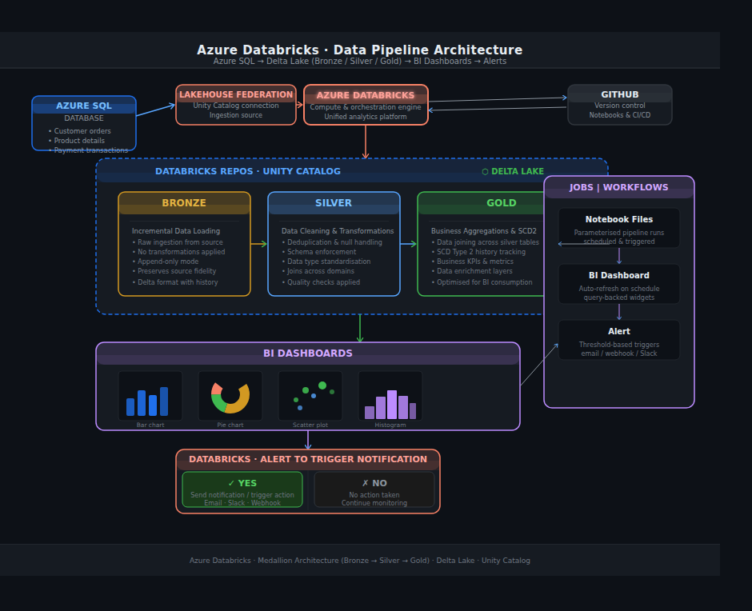
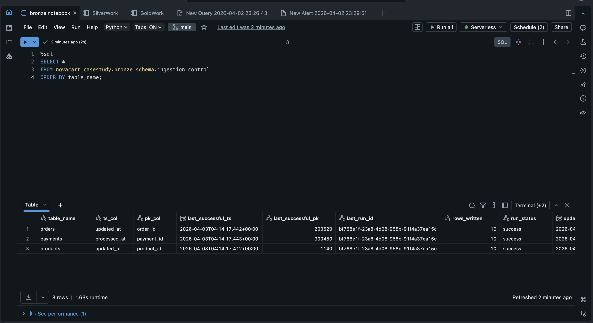
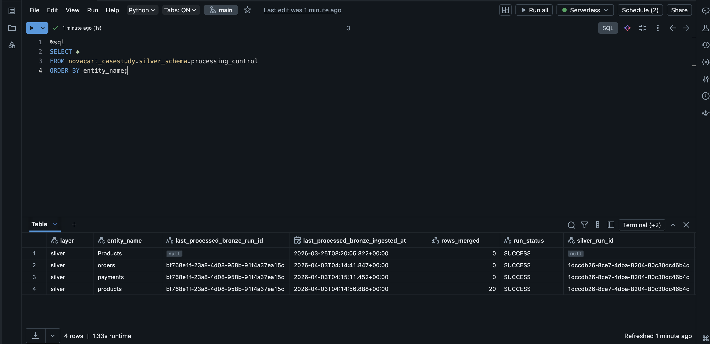
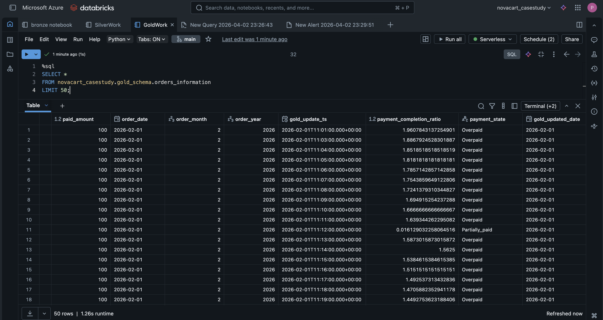
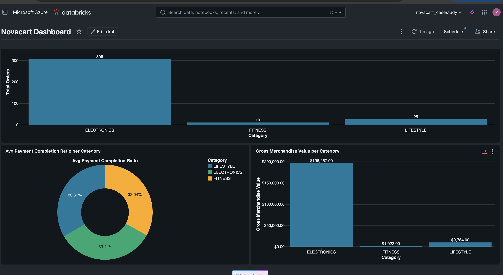

# Novacart Case Study – End-to-End Lakehouse Pipeline (Databricks)

Built a production-style data engineering pipeline using Databricks with Bronze-Silver-Gold architecture, incremental ingestion, control tables, quarantine handling, SCD Type 2 history tracking, and business-level aggregations.

Additionally implemented workflow orchestration, monitoring with alerts, and dashboards for analytics.

---

## 🔥 Key Highlights

- End-to-end Lakehouse pipeline using Databricks
- Incremental ingestion using watermark logic (timestamp + primary key)
- Control tables for Bronze, Silver, and Gold layers
- Data validation and quarantine handling
- Gold layer:
  - Incremental impacted-record processing
  - SCD Type 2 implementation
  - Category-level aggregations
- Automated pipelines using Databricks Workflows
- Monitoring using alerts
- Dashboard for business insights

---

## 🏗️ Architecture

### Flow:
Source → Bronze → Silver → Gold → Dashboard

---

## ⚙️ Tech Stack

- Databricks
- PySpark
- Delta Lake
- Unity Catalog
- SQL

---

## 🥉 Bronze Layer (Raw Ingestion)

- Incremental ingestion from source system
- Watermark logic using:
  - Timestamp columns (`updated_at`, `processed_at`)
  - Primary key as tie-breaker
- Metadata added:
  - `bronze_ingested_at`
  - `bronze_run_id`
- Control table tracks ingestion state

### 🔎 Bronze Control Table

Tracks incremental ingestion using watermark logic to ensure only new data is processed.

---

## 🥈 Silver Layer (Cleaning & Validation)

- Data standardization:
  - product name cleaning
  - category normalization
  - numeric conversions
- Data quality rules:
  - null checks
  - invalid price detection
  - invalid categories
- Quarantine handling:
  - bad records stored separately

### 🔎 Silver Processing Control

Tracks processed Bronze runs and ensures incremental Silver execution.

---

### ⚠️ Quarantine Handling

Invalid records are isolated for further review instead of polluting clean datasets.

---

## 🥇 Gold Layer (Business Layer)

### Features:
- Incremental processing using impacted records
- Joins across:
  - orders
  - products
  - payments
- Business metrics:
  - payment completion ratio
  - payment state classification
- Final analytical dataset

### 🔎 Orders Information Table

Final curated dataset combining all entities for analytics.

---

## 📊 Category Performance

Aggregated business metrics:
- Total orders
- Gross Merchandise Value (GMV)
- Total amount paid
- Payment completion ratio
- Payment failure rate

---

## ⚙️ Orchestration & Monitoring

### 🔄 Databricks Workflows

Automated execution of Bronze → Silver → Gold pipelines with task dependencies.

![Workflow]

---

### 🚨 Alerts

Configured alerts for:
- job failures
- pipeline errors

![Alerts]

---

### 📈 Dashboard

Built dashboard on top of Gold layer to visualize business metrics.

---

## 🧠 SCD Type 2 Implementation

Maintains historical changes:
- `valid_from_ts`
- `valid_to_ts`
- `is_current`

Tracks changes in:
- order status
- product data
- payment updates

---

## 🔄 Incremental Processing Design

- Bronze → watermark-based ingestion
- Silver → incremental processing using control table
- Gold → impacted-record-based processing
- Idempotent pipeline (safe re-runs)

---

## 📈 Business Value

- Enables category-level revenue analysis
- Identifies failed and incomplete payments
- Provides payment performance insights
- Supports historical tracking of changes
- Improves data reliability for analytics

---

## 📁 Project Structure

--

Novacart-Case-Study/
│
├── notebooks/
│   ├── bronze_ingestion.py
│   ├── silver_processing.py
│   └── gold_processing.py
│
├── docs/
│   ├── project_overview.md
│   ├── assumptions.md
│   └── sample_outputs.md
│
├── screenshots/
│   ├── bronze_control_table.png
│   ├── silver_processing_control.png
│   ├── gold_orders_information.png
│   ├── category_performance.png
│   ├── quarantine_examples.png
│   ├── dashboard.png
│   ├── workflow.png
│   └── alerts.png
│
└── README.md

---

## ▶️ How to Run

1. Create catalog and schemas in Databricks
2. Run Bronze ingestion notebook
3. Run Silver processing notebook
4. Run Gold processing notebook
5. Validate outputs using SQL queries

---

## ⚠️ Assumptions

- Source data contains reliable timestamps
- No delete operations (only inserts/updates)
- Categories restricted to:
  - ELECTRONICS
  - FITNESS
  - LIFESTYLE
- Invalid records are quarantined

---

## 🚧 Limitations

- No CDC implementation (timestamp-based only)
- No orchestration outside Databricks
- No streaming pipeline
- Limited monitoring framework

---

## 🔮 Future Improvements

- Add Airflow / external orchestration
- Implement CDC-based ingestion
- Add data quality framework (Great Expectations)
- Introduce streaming pipelines
- Handle schema evolution

---

## 💡 Key Takeaways

- Built production-style data pipeline using Delta Lake
- Implemented incremental ingestion with control tables
- Designed robust data quality checks and quarantine system
- Developed SCD Type 2 historical tracking
- Delivered business-ready analytical datasets
