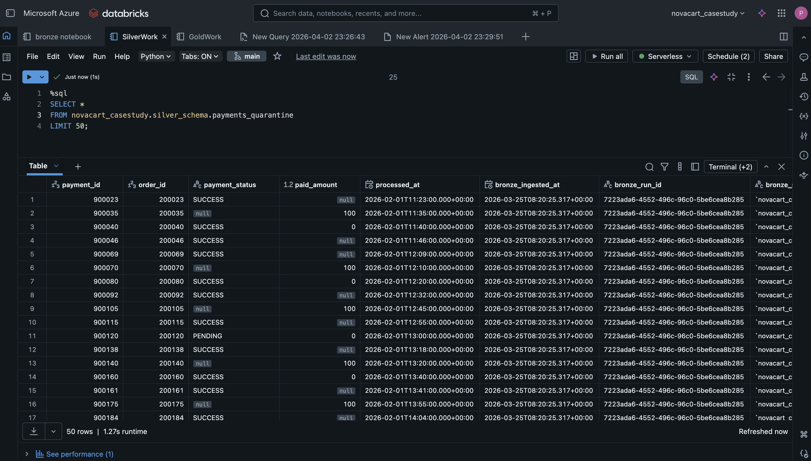
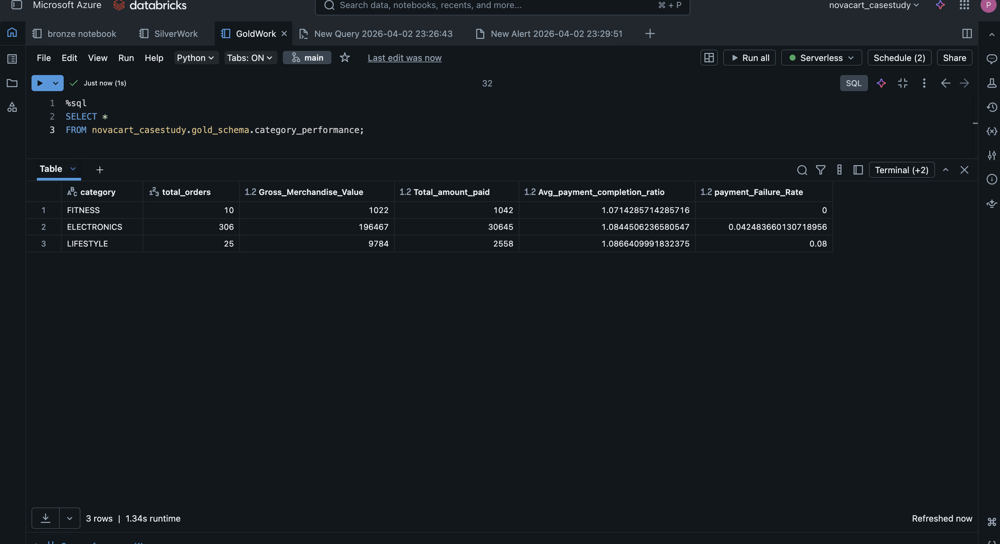

# Sample Outputs

## Bronze Layer

### Ingestion Control Table

Tracks:
- last successful timestamp
- last processed primary key
- rows written per run


---

## Silver Layer

### Cleaned Data

- Standardized product names
- Cleaned price fields
- Valid categories enforced

---

### Quarantine Table

Invalid records stored separately:

Examples:
- null product_name
- invalid price
- unknown category



---

## Gold Layer

### Orders Information Table

- Joined dataset from orders, products, payments
- Contains business-ready fields


---

### SCD Type 2 Table

Tracks historical changes:
- valid_from_ts
- valid_to_ts
- is_current flag

---

### Category Performance Table

Aggregated metrics:
- total_orders
- gross_merchandise_value
- total_amount_paid
- avg_payment_completion_ratio
- payment_failure_rate



---

## Sample Queries

### Category Summary

```sql
SELECT category, COUNT(*)
FROM novacart_casestudy.gold_schema.category_performance
GROUP BY category;
